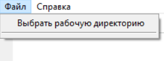
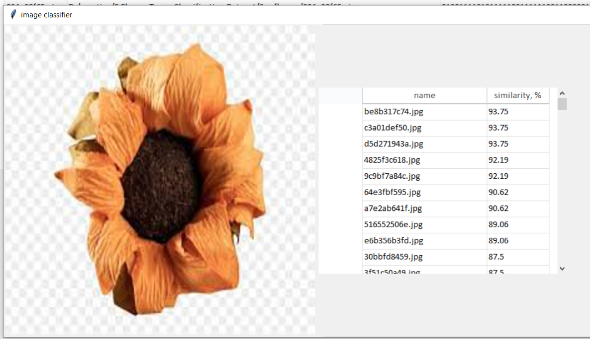
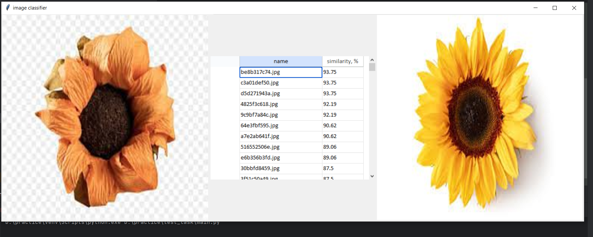

# Название вашего проекта

Краткое описание проекта.

## Установка

1. Клонируйте репозиторий:

   ```bash
   git clone https://github.com/KirillGap/BSUIR-practice-course.git

2. Перейдите в директорию проекта:
    ```bash
   cd BSUIR-practice-course/test_task
   
3. Установите зависимости:
    ```bash
   pip install -r requirements.txt
   
## Использование

1. Откройте и выберите директорию с датасетом.

2. После выбора директории таблица заполнится данными из директории.
3. Нажмите на интересующее вас изображение. После этого в отдельном окне откроется изображение и таблица с названиями других изображений из датасета и их процент схожести.

4. При нажатии на ячейку в таблице также справа от таблицы будет изображение соответствующей ячейки.
   

## Application

Методы:
1. __init__(self, master=None)
Инициализирует класс Application.

        Args:
            master: Главное окно Tkinter (по умолчанию None).
2. open_dir(self)

Открывает диалоговое окно для выбора рабочей директории.
        
3. read_dir(self, dir_name)

      
Считывает изображения из указанной директории и обновляет данные.

        Args:
            dir_name (str): Путь к директории с изображениями.

4. update_data(self)

Обновляет данные в таблице.

5. get_data(self)

Возвращает данные для отображения в таблице.
         
      Returns:
            list: Список данных об изображениях.

6. on_cell_click(self, event)

Обрабатывает событие клика по ячейке таблицы.

      Args:
            event (dict): Событие клика.

## ImageProcessor
Методы:
1. ahash(image_path)
Вычисляет aHash (average hash) для изображения.

        Args:
            image_path (str): Путь к изображению.

        Returns:
            str: Хэш-значение в виде строки.

2. compare_images(hash1, hash2)
Сравнивает два хэш-значения и возвращает процент сходства.

        Args:
            hash1 (str): Первое хэш-значение.
            hash2 (str): Второе хэш-значение.

        Returns:
            float: Процент сходства между изображениями.
3. prepare_table_data(image_list, index)
 Подготавливает данные для отображения в таблице сравнения.

        Args:
            image_list (list): Список данных об изображениях.
            index (int): Индекс выбранного изображения.

        Returns:
            list: Отсортированный список данных для таблицы.
4. prepare_image(path)
Подготавливает изображение для отображения в Tkinter.

        Args:
            path (str): Путь к изображению.

        Returns:
            ImageTk.PhotoImage: Объект изображения для Tkinter.